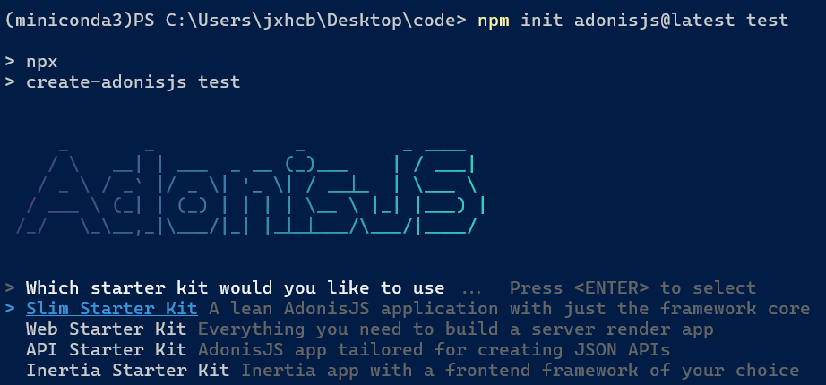
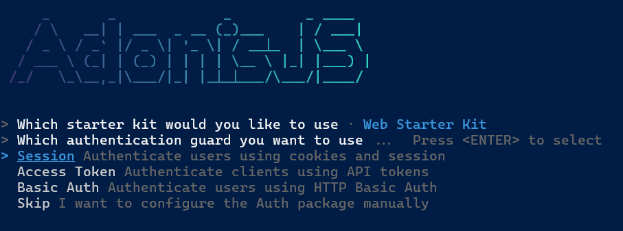
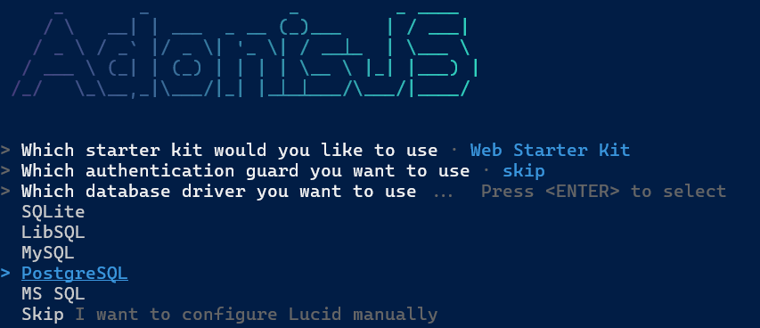

# easy_conf
Sistema de Gestão - Confecção

# Criando Projeto com AdonisJS
- Ao criar o Projeto com ```npm init adonisjs@latest (nome_do_projeto)``` temos as seguintes opções:



Fiquei cuirioso com o Inertia Starter Kit por ser relacionado com Framework de Frontend! Mas optei pelo web starter kit para seguir o tutorial.

- Na criação do projeto podemos selecionar os seguintes tipos de Autenticação. Selecionei o "SKIP" por não conhecer a respeito...mas podemos iniciar com as pré-configurações de autenticação indicadas pelo adonis.





- Também na criação, podemos selecionar o tipo de banco de dados. Selecionado Postegres mas achei válido registrar as demais opções suportadas. Sei também que é possível utilizar outros bancos de dados além desses mas não deve ser tão facilitado.



- Para iniciar o Adonis 
```
npm run dev
```


